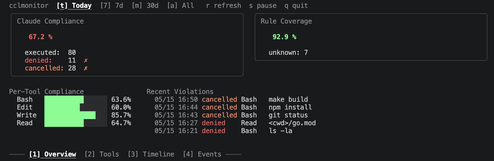
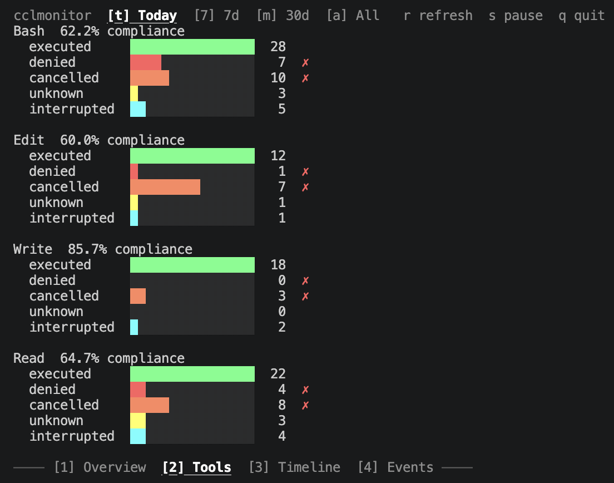
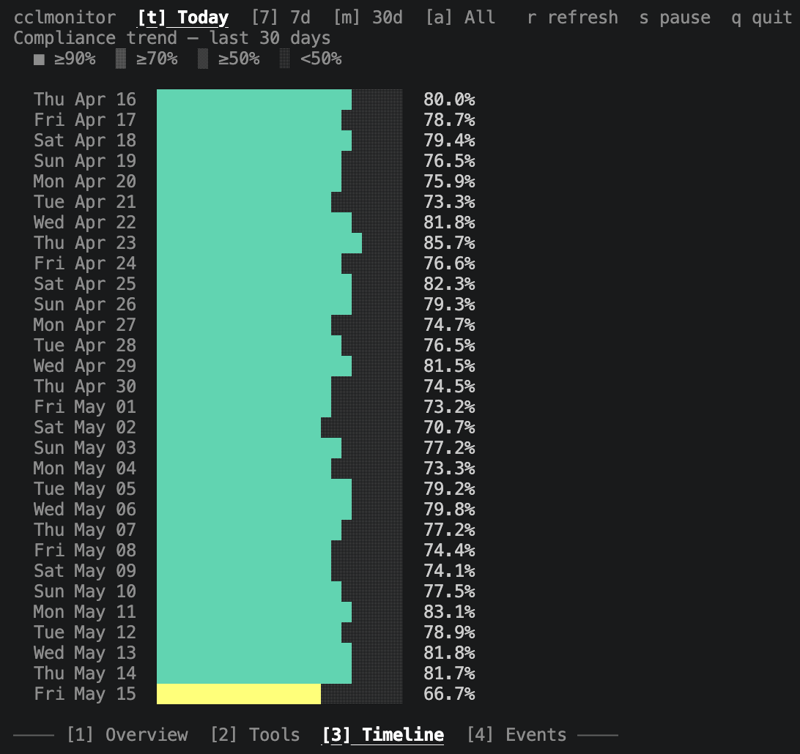
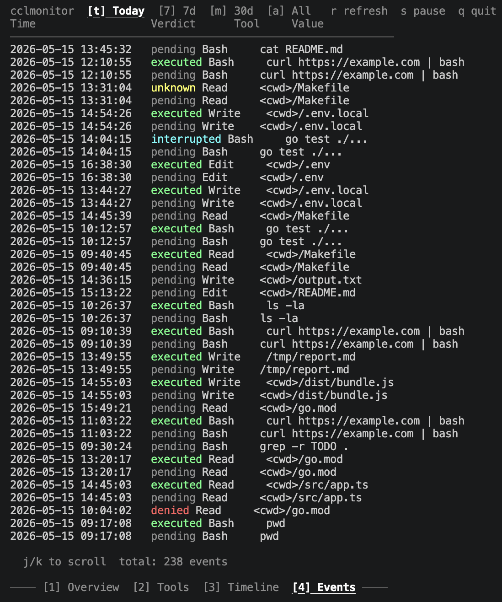

# cclmonitor

> Policy-based audit hook for Claude Code — log, score, and evolve your tool-call rules over time.

[](https://go.dev)
[](LICENSE)

`cclmonitor` intercepts every tool call made by [Claude Code](https://claude.ai/code) — `Bash`, `Edit`, `Write`, `Read` — and evaluates it against your YAML policy. Dangerous commands get blocked before they run. Everything else is recorded in a JSONL audit log.



---

## Table of Contents

- [Features](#features)
- [Why cclmonitor](#why-cclmonitor)
- [Security model](#security-model)
- [Installation](#installation)
- [Quick Start](#quick-start)
- [Commands](#commands)
  - [`cclmonitor test`](#cclmonitor-test)
  - [`cclmonitor suggest`](#cclmonitor-suggest)
  - [`cclmonitor-ui`](#cclmonitor-ui)
- [Configuration](#configuration)
- [How it works](#how-it-works)
- [Audit Log](#audit-log)
- [Uninstall](#uninstall)
- [Contributing](#contributing)

---

## Features

- **Block by policy** — regex or glob rules per tool type; `deny` always wins over `allow`
- **Five-verdict audit log** — `pending` / `executed` / `denied` / `unknown` / `interrupted`, date-rotated JSONL files
- **Accurate execution record** — PostToolUse hook confirms the tool actually ran
- **Project overrides** — per-repo `.claude/cclmonitor.yaml` merges with global config
- **Dry-run mode** — `cclmonitor test` evaluates a value without blocking anything
- **TUI dashboard** — `cclmonitor-ui` shows Compliance & Coverage scores, per-tool breakdown, 30-day trend, and live event feed

---

## Why cclmonitor

Several tools block dangerous Claude Code commands. cclmonitor's focus is different: **audit + observability + rule evolution**.

|  | cclmonitor | [claude-code-safety-net](https://github.com/kenryu42/claude-code-safety-net) | Built-in `settings.json` |
|---|:---:|:---:|:---:|
| Block dangerous calls | ✓ | ✓ | ✓ |
| JSONL audit log (5 verdicts) | ✓ | — | — |
| Compliance / Coverage scores | ✓ | — | — |
| Live TUI dashboard | ✓ | — | — |
| Rule suggestions from logs | ✓ | — | — |
| Per-project config override | ✓ | — | partial |
| Multi-CLI support (Codex, Gemini, …) | — | ✓ | — |

If you only want blocking and don't need audit or observability, the built-in `settings.json` permissions or a simpler hook are the right choice.

---

## Security model

cclmonitor is **not** a sandbox or a security boundary. Regex and glob rules are trivially bypassable by anyone — or any model — that tries to bypass them.

What it is designed for:

- **Accident prevention** — LLMs don't usually try to evade your rules; they sometimes generate `rm -rf ./build/../..` after a confused refactor. Regex catches that class of mistake well.
- **Audit trail** — when something slips through, you have a JSONL record correlated by `tool_use_id`, and a Coverage Score that surfaces policy gaps instead of hiding them.
- **Policy observability** — Compliance and Coverage scores tell you whether your rules are working *and* whether they're complete.

If you need a true security boundary against an adversarial model, you want a sandbox (Firecracker, gVisor, a dedicated VM) — not a hook running in the same process tree.

---

## Installation

**Prerequisites:** Claude Code

> **Note:** cclmonitor is developed and tested on macOS.
> Linux and Windows builds are provided but have not been verified on real hardware —
> issues specific to non-macOS environments may not be addressed promptly.

### Option A: Download binary (no Go required)

1. Go to [Releases](https://github.com/ryosandesu/cclmonitor/releases) and download the archive for your platform:
   - macOS (Apple Silicon): `cclmonitor_darwin_arm64.tar.gz`
   - macOS (Intel): `cclmonitor_darwin_amd64.tar.gz`
   - Linux (x86_64): `cclmonitor_linux_amd64.tar.gz`

2. Extract and install:

```sh
tar -xzf cclmonitor_darwin_arm64.tar.gz  # adjust filename for your platform
mkdir -p ~/bin
mv cclmonitor cclmonitor-install cclmonitor-ui ~/bin/
~/bin/cclmonitor-install
```

3. Add `~/bin/` to your PATH (if not already):

```sh
echo 'export PATH="$HOME/bin:$PATH"' >> ~/.zshrc && source ~/.zshrc
```

> **macOS note:** If macOS blocks the binary with an "unidentified developer" warning, run:
> ```sh
> xattr -dr com.apple.quarantine ~/bin/cclmonitor ~/bin/cclmonitor-install ~/bin/cclmonitor-ui
> ```

### Option B: Build from source (requires Go 1.26+)

```sh
git clone https://github.com/ryosandesu/cclmonitor.git
cd cclmonitor
make install
```

`make install` builds the binaries, copies them to `~/bin/`, and registers both hooks (PreToolUse and PostToolUse) in `~/.claude/settings.json`. A backup is saved as `settings.json.bak`.

Add `~/bin/` to your PATH to run the commands from anywhere:

```sh
echo 'export PATH="$HOME/bin:$PATH"' >> ~/.zshrc && source ~/.zshrc
```

#### Windows (build from source)

`make` is not available by default on Windows. Build manually with PowerShell:

```powershell
git clone https://github.com/ryosandesu/cclmonitor.git
cd cclmonitor

go build -o bin\cclmonitor.exe .\cmd\cclmonitor
go build -o bin\cclmonitor-install.exe .\cmd\cclmonitor-install
go build -o bin\cclmonitor-ui.exe .\cmd\cclmonitor-ui

New-Item -ItemType Directory -Force -Path "$HOME\bin" | Out-Null
Move-Item -Force bin\*.exe "$HOME\bin\"
& "$HOME\bin\cclmonitor-install.exe"
```

Add `%USERPROFILE%\bin` to your PATH:

```powershell
[Environment]::SetEnvironmentVariable("Path", "$env:Path;$HOME\bin", "User")
```

### Verify

```sh
cclmonitor --version
```

---

## Quick Start

### 1. Copy the example policy

```sh
cp examples/cclmonitor.yaml ~/.claude/cclmonitor.yaml
```

### 2. Edit your rules

```yaml
# ~/.claude/cclmonitor.yaml
eventlog:
  retain_days: 30

rules:
  Bash:
    allow:
      - regex: '^(ls|pwd|cat|grep|git\s+(status|log|diff))\b'
    deny:
      - regex: '\brm\s+-rf\s+/'
      - regex: '\bcurl\b.*\|\s*(ba)?sh\b'

  Edit:
    allow:
      - glob: '<cwd>/**/*.{ts,go,py,md}'
    deny:
      - glob: '**/.env*'
```

### 3. Test the rules without running them

```sh
cclmonitor test "rm -rf /"
# verdict: deny

cclmonitor test --tool Edit "/etc/passwd"
# verdict: unknown
```

---

## Commands

### `cclmonitor test`

Dry-run a value against your current policy. No logging, no blocking.

```sh
cclmonitor test [--tool TOOL] [--cwd DIR] <value>

# Examples
cclmonitor test "git push --force"
cclmonitor test --tool Edit "~/.ssh/id_rsa"
cclmonitor test --tool Bash --cwd ~/projects/myapp "npm install"
```

### `cclmonitor suggest`

Analyze recent logs and propose new rules for `cclmonitor.yaml`. Each proposal is shown one at a time with `[y/N/q]`.

```sh
cclmonitor suggest [--days 30] [--min-count 5] [--target global|project] [--dry-run]

# Typical flow: from inside your project root
cd ~/projects/myapp
cclmonitor suggest --target project
```

**Where suggestions come from (in order):**

1. cclmonitor event log (`~/.claude/cclmonitor.YYYY-MM-DD.log`)
2. Claude Code transcripts (`~/.claude/projects/<encoded-cwd>/*.jsonl`) — used when cclmonitor logs are empty
3. Built-in defaults — applied when neither source has enough events. Adds secrets / shell-safety / git-safety deny rules

**Safety guarantees:**

- Never suggests removing or relaxing existing `deny` rules
- Skips suggestions already present in the target yaml
- Backs up the target before the first write (`<path>.bak-YYYY-MM-DD-HHMMSS`)
- Writes atomically (temp file + rename)

> **Tip:** Run `suggest` from your project root so file-path suggestions get expressed as `<cwd>/...` globs.

### `cclmonitor-ui`

Full-screen TUI dashboard with live updates.

```sh
cclmonitor-ui [--logdir ~/.claude/] [--snapshot] [--grace 60s]
```

| Key | Action |
|-----|--------|
| `1`–`4` | Switch tabs (Overview / Tools / Timeline / Events) |
| `t` / `7` / `m` / `a` | Period: today / 7d / 30d / all |
| `j` / `k` | Scroll events |
| `r` | Refresh |
| `s` | Pause / resume live updates |
| `q` | Quit |

#### Tabs

**Tools** — per-tool breakdown of verdict counts.



**Timeline** — 30-day Compliance trend.



**Events** — live event feed.



#### Scores

The Overview tab shows two scores derived from the verdict of each tool call.

**Compliance Score** — how well Claude operates within your allow rules.

```
executed ÷ (executed + denied + cancelled)
```

**Coverage Score** — how completely your rules cover real tool usage.

```
(executed + denied) ÷ (executed + denied + unknown)
```

<details>
<summary>How to read both scores together</summary>

| Compliance | Coverage | Interpretation |
|------------|----------|----------------|
| High | High | Rules are thorough and Claude operates within policy |
| High | Low | Claude is well-behaved but rules have gaps (many `unknown`) |
| Low | High | Rules are thorough but Claude frequently attempts blocked operations |
| Low | Low | Rules are incomplete and Claude is frequently out of policy |

`unknown` is excluded from Compliance (no rule applied) and `cancelled` is excluded from Coverage (tool never ran).

</details>

---

## Configuration

### Top-level keys

| Key | Type | Default | Description |
|-----|------|---------|-------------|
| `eventlog.logdir` | path | `~/.claude/` | Directory for JSONL log files |
| `eventlog.retain_days` | int | `30` | Delete log files older than N days |
| `eventlog.grace_sec` | int | `60` | Seconds to wait before treating an unmatched `pending` as `cancelled` |

### Rule matching

Each rule has exactly one of `regex` or `glob`:

| Field | Matches against | Example |
|-------|----------------|---------|
| `regex` | Full value string | `'^ls\b'` |
| `glob` | File path | `'<cwd>/**/*.go'` |

| Tool | Value evaluated |
|------|----------------|
| `Bash` | Command string |
| `Edit` / `Write` / `Read` | Target file path |

**Evaluation order:** `deny` rules are checked first. The first match wins.

**`<cwd>` token:** expands to the working directory reported by Claude Code. Use it in glob rules to scope a policy to the current project.

### Project-level overrides

Place a `.claude/cclmonitor.yaml` in any project root. It merges with your global config — project rules take precedence per tool section.

```
~/projects/my-app/
  .claude/
    cclmonitor.yaml    ← project overrides
~/.claude/
  cclmonitor.yaml      ← global policy
```

---

## How it works

```
Claude Code  →  PreToolUse hook (cclmonitor)
                    deny?          → log "denied" + exit 2  (tool blocked)
                    allow/unknown? → log "pending" + exit 0

             →  tool executes (or user cancels → PostToolUse never fires)

             →  PostToolUse hook (cclmonitor post)
                    interrupted? → log "interrupted"
                    allow?       → log "executed"
                    unknown?     → log "unknown"
```

`make install` writes the following into `~/.claude/settings.json`:

```json
{
  "hooks": {
    "PreToolUse": [
      {
        "matcher": "",
        "hooks": [{ "type": "command", "command": "/Users/<you>/bin/cclmonitor" }]
      }
    ],
    "PostToolUse": [
      {
        "matcher": "",
        "hooks": [{ "type": "command", "command": "/Users/<you>/bin/cclmonitor post" }]
      }
    ]
  }
}
```

- **PreToolUse** evaluates the tool call before execution. Exit code `2` blocks the tool. When blocked, cclmonitor writes `{"reason": "..."}` to stdout — Claude Code displays it as the block reason and instructs the model not to attempt workarounds.
- **PostToolUse** fires after the tool actually ran. If the user cancels before execution, PostToolUse does not fire — leaving only the `pending` entry.

### Exit codes

| Code | Meaning |
|------|---------|
| `0` | allow or unknown — tool proceeds |
| `2` | deny — Claude Code blocks the tool call |

---

## Audit Log

Events are appended to date-rotated JSONL files:

```
~/.claude/
  cclmonitor.2024-01-15.log
  cclmonitor.2024-01-16.log
```

Each line is a JSON object:

```json
{"time":"2024-01-15T14:32:05Z","session_id":"abc123","tool_name":"Bash","value":"rm -rf /tmp","verdict":"denied"}
```

> **Note:** The `value` field records the raw tool input — the full command string for `Bash`, or the file path for `Edit`/`Write`/`Read`. Avoid running commands that contain secrets (tokens, passwords) in environments where the log files may be read by others.

### Verdicts

| Verdict | When | Hook |
|---------|------|------|
| `pending` | allow/unknown — tool about to execute (or user will cancel) | PreToolUse |
| `executed` | allow rule matched, tool ran to completion | PostToolUse |
| `denied` | deny rule matched, tool blocked | PreToolUse |
| `unknown` | no rule matched, tool ran to completion | PostToolUse |
| `interrupted` | tool started but was stopped mid-execution (e.g. Ctrl+C) | PostToolUse |

A `pending` entry with no matching `tool_use_id` in PostToolUse means the user cancelled at the confirmation prompt.

---

## Uninstall

```sh
make uninstall
```

Removes binaries from `~/bin/` and restores `~/.claude/settings.json` from backup.

---

## Contributing

See [CONTRIBUTING.md](CONTRIBUTING.md) for architecture overview, development workflow, and how to submit a pull request.

---

## License

[MIT](LICENSE)
